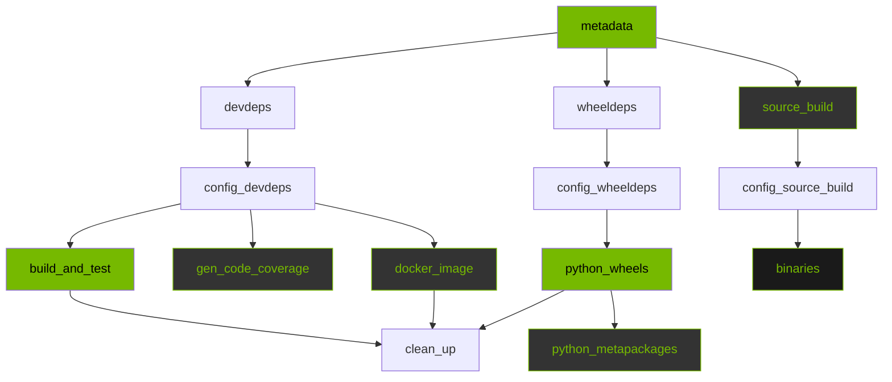

# CUDA Quantum CI Pipeline

This document describes the CI pipeline for CUDA Quantum,
its structure, timing, and the tiered execution model.

## Pipeline Overview

The CI workflow (`ci.yml`) runs on every PR push
(via copy-pr-bot) and on merge queue checks. It builds
and tests CUDA Quantum across multiple platforms,
toolchains, and package formats.



**Legend**: Bright green = runs on all tiers.
Dark with green text = skipped on PR tier.
Black = critical path (full tier only).

## CI Tiers

The pipeline supports two tiers to balance speed
and coverage:

| Trigger | Tier | Description |
|---------|------|-------------|
| `push` on `pull-request/*` | **pr** | Reduced validation |
| `merge_group` | **full** | Complete validation |
| `workflow_dispatch` (default) | **full** | Complete validation |
| `workflow_dispatch` `ci_level=pr` | **pr** | Manual override |

### What changes on PR tier

| Area | PR tier | Full tier |
|------|---------|-----------|
| Build and test (Debug) | amd64 x 3 + arm64 x 1 | amd64 + arm64 x 3 |
| Build and test (Python) | Skipped | amd64 + arm64 x 3 |
| Installer build + validation | Skipped | Full |
| Docker images | Skipped | amd64 + arm64 |
| Wheel validation OS | ubuntu + ubi9 | Full (5 images) |
| Code coverage | Skipped | Runs |
| Python metapackages | Skipped | Runs |

### How to force full CI on a PR

Use the Actions tab to run the workflow manually
with `ci_level=full` on the PR branch.

## Critical Path

### Full tier (~69 min)

The wall-clock time is dominated by the
**installer build chain**:

```text
metadata (7s)
  --> source_build cache loading (10 min)
    --> config_source_build (seconds)
      --> installer build on cpu32 (34 min)
        --> installer validation per OS (14-24 min)
```

With 5 OS images, the longest validation (fedora)
adds ~24 min, totaling ~69 min.

### PR tier (~40 min)

Installers and Docker images are skipped. arm64
runs clang16 only. The critical path shifts to
**build_and_test on arm64**:

```text
metadata (7s)
  --> devdeps parallel (3 min)
    --> config_devdeps (seconds)
      --> arm64 clang16 Debug build+test (36 min)
```

All other PR jobs (amd64 build_and_test, python
wheels) run in parallel and complete within this
window.

## Timing Reference

Typical durations from a cached PR run:

| Job | Configs | Per job | Total |
|-----|---------|---------|-------|
| devdeps | 6 | ~3 min | ~18 min |
| wheeldeps | 4 | ~1 min | ~4 min |
| source_build | 4 | ~10 min | ~40 min |
| build_and_test (Debug) | 6 | 27-36 min | ~180 min |
| build_and_test (Python) | 6 | 19-27 min | ~135 min |
| gen_code_coverage | 1 | ~20 min | ~20 min |
| Docker images (build) | 2 | 12-20 min | ~32 min |
| Docker images (validation) | 2 | 18-37 min | ~55 min |
| Python wheel (build) | 8 | ~10 min | ~80 min |
| Python wheel (validation) | up to 80 | 8-13 min | ~800 min |
| Installer (build) | 4 | 33-36 min | ~136 min |
| Installer (validation) | up to 12 | 14-24 min | ~200 min |

## Matrix Dimensions

### build_and_test

- **Platforms**: amd64, arm64
- **Toolchains**: clang16, gcc11, gcc12
- **MPI**: openmpi
- **Sub-jobs per config**: Debug (always), Python (full tier only)

### Python wheels

- **Platforms**: amd64, arm64
- **Python versions**: 3.11, 3.13
- **CUDA versions**: 12.6, 13.0
- **Validation OS** (per `validation_config.json`):
  - py3.11: ubuntu, debian, fedora, ubi8, ubi9
  - py3.13: fedora
- **Validation modes**: default, `--user`

### Installers (prebuilt binaries)

- **Platforms**: amd64, arm64
- **CUDA versions**: 12.6, 13.0
- **Validation OS** (varies by platform/CUDA):
  - amd64/CUDA12: ubuntu, debian, ubi9, opensuse, fedora
  - amd64/CUDA13: ubuntu, debian, opensuse, fedora
  - arm64/CUDA12: ubuntu, ubi9
  - arm64/CUDA13: ubuntu

## Runner Allocation

| Runner | Cores | Used by |
|--------|-------|---------|
| `linux-amd64-cpu8` | 8 | build_and_test, devdeps, wheels |
| `linux-amd64-cpu16` | 16 | Docker image builds |
| `linux-amd64-cpu32` | 32 | Installer/asset builds |
| `linux-arm64-cpu8` | 8 | arm64 builds, wheels |
| `linux-arm64-cpu16` | 16 | arm64 Docker images |
| `ubuntu-latest` | GH | metadata, config, cleanup |

## Caching Strategy

The pipeline uses three layers of caching:

1. **Docker BuildKit layer cache**: Stored in GHCR
   as `buildcache-cuda-quantum-*` images. Lookup
   order: PR-specific, base branch, main, nvidia.

2. **Compiler cache (ccache)**: 3GB limit, zstd.
   Stored in GHCR via ORAS. Pushed on main always;
   on PRs only if cache changed by >10%.

3. **Tar archive cache**: Docker images saved as
   tar in GitHub Actions cache. Enables dev env
   reuse across jobs in the same workflow run.

## Configuration Files

| File | Purpose |
|------|---------|
| `ci.yml` | Main CI orchestrator |
| `dev_environment.yml` | Build/cache dev images |
| `test_in_devenv.yml` | Build + test in containers |
| `python_wheels.yml` | Wheel build + validation |
| `prebuilt_binaries.yml` | Installer build + validation |
| `docker_images.yml` | Docker image build + validation |
| `generate_cc.yml` | Code coverage |
| `config/validation_config.json` | OS validation matrices |
| `.github/actions/ccache-*` | Compiler cache actions |

All workflow files are in `.github/workflows/`.
