# Performance Benchmarking

Performance benchmarking requires using special systems that have been set up for benchmarking purposes. These systems are not readily available in Github, and thus a more complicated workflow has to be employed.

```mermaid
---
config:
  theme: 'base'
  themeVariables:
    primaryColor: '#ffffffff'
    primaryTextColor: '#ffffffff'
    primaryBorderColor: '#76B900'
    lineColor: '#76B900'
    clusterBkg: '#5e5c63'
    clusterBorder: '#76B900'
    mainBkg: '#5e5c63'
    titleColor: '#76B900'
---
flowchart TD
    Github[Github perf.yml Workflow triggered]

    Workflow("`Create a new branch bot/**WORKFLOW_ID**/perf`")

    commit("`Create a new commit
    ghcr.io/nvidia/cuda-quantum@sha256:**COMMIT_SHA**`")

    %% contents("`perf/cuda-quantum/**COMMIT_SHA**`")
    contents["create file perf/**COMMIT_SHA** with metadata"]

    ssh[ssh into perf runner]
    
    bash[Start bash script with parameters to queue job]

    prepare[Read the new perf commit title/contents to fill metadata]

    wait1{Wait for gitlab to sync }

    wait2{Wait for slurm job to run}

    slurm[start an sbatch job for the right performance test]

    cleanup[Clean up and check that performance run was executed successfully]

    finalize[Transfer data to data repository]


    Github --> GithubRunner

    subgraph GithubRunner["github Runner"]
        direction TB

        Workflow --> commit
        commit --> contents
        end
    GithubRunner e1@--> wait1
    e1@{ animation: fast }

    wait1 e2@--> gitlab
    e2@{ animation: fast }

    subgraph gitlab["gitlab Runner"]
        direction TB

        prepare --> ssh
    end
    gitlab --> perfRunner

    subgraph perfRunner["Perf Runner"]
        direction TB

        bash --> slurm
        slurm e3@--> wait2
        e3@{ animation: fast }
        wait2 e4@--> cleanup
        e4@{ animation: fast }
        cleanup --> finalize
    end
    perfRunner --> database1


    database1[(Database)]
```




The contents of the file `perf/COMMIT_SHA` in the commit will be:
```yaml
source-sha: 9db48592d03ea7478b20d8785447b02411c68de3
cuda-quantum-image: nvcr.io/nvidia/nightly/cuda-quantum@sha256:1b66c98db7cf9f1bdc1376d96ae42308316dd748695898efcf54a0190c7b3292
platforms: linux/amd64,linux/arm64
GPU: GH200,B200 # Options: A100,GH200,B200,H100,ALL
GPUs: 1 # Options, 1, 4, 8
```
